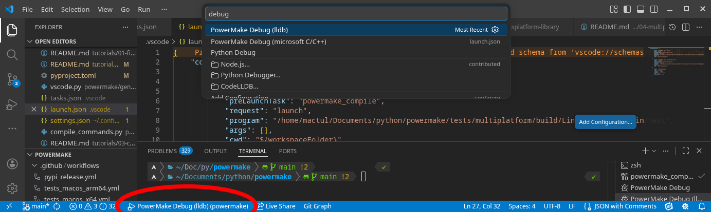

<!-- This file, beeing part of the documentation is excluded from AI restrictions of the license -->
# Set up your IDE

### [<- Previous tutorial (First PowerMake)](../01-first-powermake/README.md)

## Visual-Studio Code

Vscode is a very popular code editor, but it's not exactly an IDE as it relies on extensions to provide code completion and debug.  
In this tutorial we will learn how to set up the most common vscode extensions to use PowerMake correctly.

### Code colors, completion, syntax check, etc...

For editing C/C++ code you basically have 2 choices:
- The Microsoft C/C++ extension
- The LLVM clangd extension

The former, beeing developped by Microsoft is recommended by vscode, but we recommend the latter as it's way more powerful.

Both extensions rely on a `compile_commands.json` file that can be generated by PowerMake.  
We recommend putting the `compile_commands.json` in the `.vscode/` folder as it will help keep your worktree cleaner.
```sh
python makefile.py -rd -o .vscode/
```

If you are using clangd, we recommend using the flag `--clangd-compat`
```sh
python makefile.py -rd -o .vscode/ --clangd-compat
```
This flag will generate a `compile_commands.json` which contains commands flags as if powermake were compiling for clang, even though you are in reality compiling with another compiler. This ensures clangd will not raise "unknown flags" warnings.

> [!TIP]  
> You need to regenerate the `compile_commands.json` each time a file is added, or compilation flags are changed, so it's a good idea to include the `-o` each time you compile.  
> Later when setting up the debugger we will plug the compilation with the `-o` flag on a keymap.


Now we need to tell the extension to look for the compile_commands.json in the `.vscode/` folder.

> [!NOTE]  
> Below we will show how to manually set these settings but the `python makefile.py --generate-vscode` command that we will see later can do that automatically, not globally but per project.

Use `Ctrl+Shift+P` (`Cmd+Shift+P` on macOS) and search "settings json", click on "Preferences: Open User Settings (JSON)".

What we will put here depends on the extension you chose.
- For clangd:
  - Set "clangd.arguments"
    ```json
    {
        /* Other settings here */
        /* ... */
        "clangd.arguments": [
            "--compile-commands-dir=.vscode",
        ],
    }
    ```
    You can also add other arguments to clangd if you wish, for example I personaly like adding `--header-insertion=never` so clangd doesn't insert random includes at the top of my files.
    ```json
    {
        /* Other settings here */
        /* ... */
        "clangd.arguments": [
            "--compile-commands-dir=.vscode",
            "--header-insertion=never",
        ],
    }
    ```

- for Microsoft C/C++
  - set "C_Cpp.default.compileCommands"
    ```json
    {
        /* Other settings here */
        /* ... */
        "C_Cpp.default.compileCommands": ".vscode/compile_commands.json"
    }
    ```

### Compilation, debugging

If you are a purist, you are probably using `gdb` or `lldb` in command-line, it's great as it gives you a ton of power, but for begginers it's a bit rough and for many devs it's too slow, the graphical debugger is a great confort for them.  
Sadly the vscode graphical debugger is really hard and penible to set up.

PowerMake makes the experience of setting up a graphical debugger in vscode much more enjoyable.

First, you will need a graphical debugger. You have 2 extension choices:
- The Microsoft C/C++ extension
- The LLVM codelldb extension

Both extensions are very similar, the only noticeable difference is the syntax of the watch window.  
I recommend using codelldb if you chose clangd, it's the same ecosystem, and it will work on other IDEs (like NeoVIM).  
If you chose the Microsoft C/C++ extension, it's easier to just use the debugger of this extension.

If you are feeling a bit adventurous, you can try [codelldb-enhanced](https://github.com/mactul/codelldb-enhanced) which is a fork of codelldb maintained by me to implement better hovering of complex variables (like `vertices[i].position.x`).

Once you have your extension is installed, everything comes down to a single command:

```sh
python makefile.py --generate-vscode
```

This will generates 3 files, `.vscode/settings.json`, `.vscode/tasks.json` and `.vscode/launch.json`.

- If you have set up clangd (or C/C++) in your user settings, you don't care about the `.vscode/settings.json`, you can delete it.

- `.vscode/tasks.json` describe how the compilation should be run, by default powermake put `-o` and `--clang-compat` to generate a good `compile_commands.json`.

- `.vscode/launch.json` set up the tool to debug when `<F5>` is pressed and call the compilation in `tasks.json`.  
    By default, powermake generates 3 configs in this file:
    - One to debug python (if you need to debug powermake)
    - One for debugging using codelldb
    - One for debuggin using Microsoft C/C++

Once all that is set up, you will be able to put a breakpoint in your main.c file using `<F9>`.

Then choose the right debugger config:


Choosing the debugger will start your debugging session, to start it the next time without having to go in this menu, just press `<F5>`.

> [!IMPORTANT]  
> Once you have run `python makefile.py --generate-vscode` at least once, you can edit the default vscode template in `~/.powermake/vscode_templates/`.
>
> You can for example remove the config you are not using in `~/.powermake/vscode_templates/launch.json` to never be bothered by it again.
>
> If you want to regenerate one of these templates from the default, just delete the file then run `python makefile.py --generate-vscode`

### [-> Next tutorial (Cross-platform library)](../03-crossplatform-library/README.md)